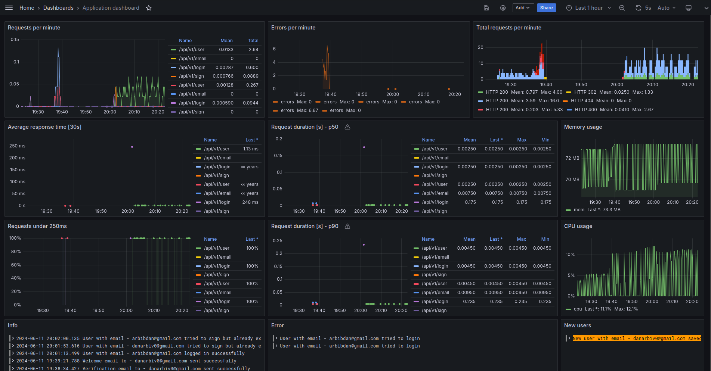

# A starter template for building microservices based SaaS applications

This repository provides a base for building a SaaS application with the following technologies:

- **Frontend**: Vue.js
- **Backend**: Python (Flask)
- **Database**: Postgres
- **Web Server**: Nginx
- **Message Queues**: RabbitMQ & Redis
- **Monitoring and log Collection**: Promtail & Loki & Prometheus & Grafana

Additional notes:

- **User authentication**: JWT
- **Payment integration**: Stripe payment

This project utilizes Docker for containerized deployment.

## Getting Started

### Prerequisites:

- Docker installed: [https://www.docker.com/](https://www.docker.com/)
- Docker Compose installed: [https://docs.docker.com/compose/install/](https://docs.docker.com/compose/install/)

### Clone the repository:

```bash
git clone https://github.com/DanArbib/SaaS-App-Starter.git
```

### Configure environment variables:

Create a file named `.env` in the project root directory. This file should contain environment variables required by your application and services. Refer to the `.env.example` file for guidance.

### Start the application:

```bash
docker-compose up -d
```

This will start all the required services, access the application in your web browser at** [http://localhost:80](http://localhost:80)


## Monitoring

